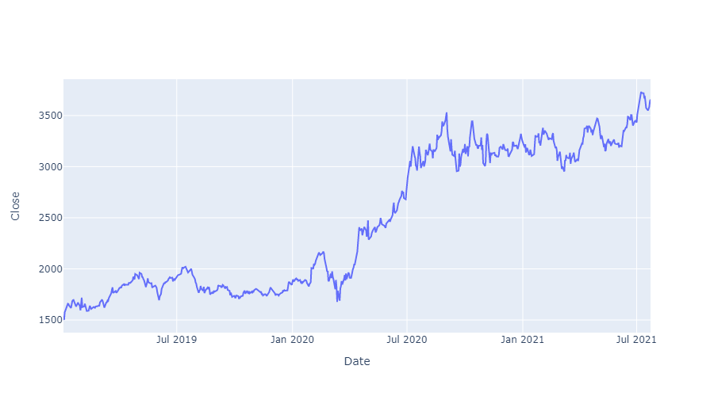
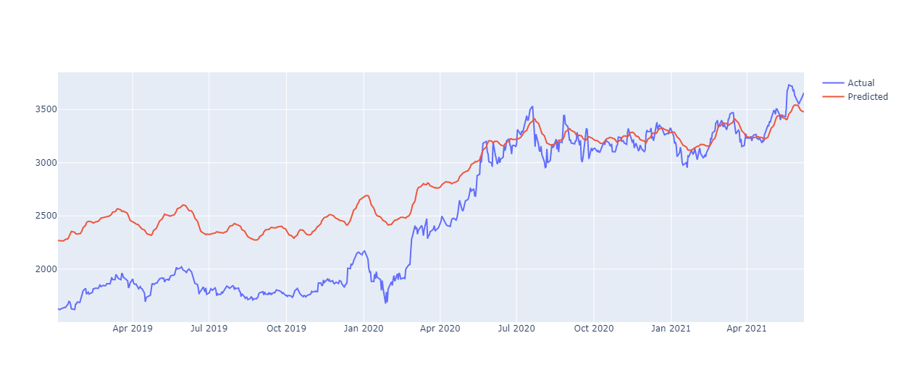

# Stock-Market-Prediction

## Description
The stock market is the collection of markets and exchanges where regular activities of buying, selling and issuance of shares of publicly held companies take place. Stock market investments, they generate great profits and it is a fundamental stimulus for most of the market researchers in this particular area now to predict the stock price

## Dataset
The open source API that we are going to use for fetching the stock data is YFINANCE, YFINANCE offers a reliable credit and Pythonic way to download historical market data from Yahoo! Finance.

## Technologies used

1. Prgramming Language - Python 3.8
2. Libraries - Tensorflow 2.2, Plotly, Pandas.

## Plots
**Close Price prediction of the stock without using RSI indicator**

**Close Price prediction of the stock after using RSI indicator**
With the help of RSI

